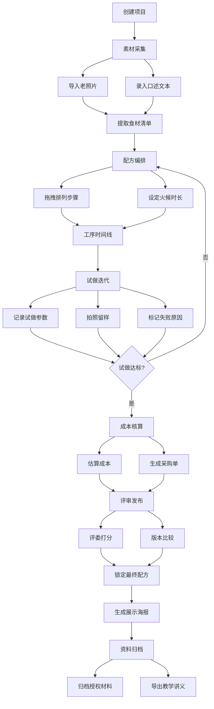

## 1. 产品概述

失传菜谱复原桌面应用，面向非遗厨师、餐饮教研室和纪录片团队，在试做现场提供从素材采集、配方还原、试做记录到评审归档的全流程数字化支撑。解决传统菜谱复原过程中素材散落、试做参数无记录、版本难以比较、成果无法标准化输出的痛点。

- 目标用户：非遗传承厨师、餐饮教研室研究员、纪录片编导团队
- 核心价值：将口述+影像的碎片化菜谱知识系统化还原，形成可复现、可评审、可教学的标准化配方

## 2. 核心功能

### 2.1 用户角色

| 角色 | 进入方式 | 核心权限 |
|------|----------|----------|
| 主厨/传承人 | 本地启动 | 全部操作权限，配方锁定与发布 |
| 研究员 | 本地启动 | 素材录入、配方编辑、成本估算、讲义导出 |
| 评委 | 本地启动 | 评审打分、版本比较 |
| 纪录片团队 | 本地启动 | 素材查看、试做记录、归档查阅 |

### 2.2 功能模块

1. **工作台**：项目导航、快速入口、最近配方概览
2. **素材库**：导入老照片、录入口述文本、AI辅助提取食材清单
3. **配方板**：拖拽编排烹饪步骤、设置火候与时长、食材用量配置
4. **工序时间线**：可视化时间线展示步骤流程、依赖关系、关键火候节点
5. **试做记录**：记录每次试做参数、拍照留样、标记失败原因、版本迭代
6. **采购成本**：食材单价管理、成本估算、生成采购清单
7. **评审发布**：邀请评委打分、多轮版本对比、锁定最终配方、生成展示海报
8. **资料归档**：授权材料归档、教学讲义导出、项目资料打包

### 2.3 页面详情

| 页面名称 | 模块名称 | 功能描述 |
|----------|----------|----------|
| 工作台 | 项目概览 | 展示当前项目列表、最近编辑的配方、快速创建入口 |
| 工作台 | 统计卡片 | 配方总数、试做次数、评审状态、归档进度 |
| 素材库 | 照片导入区 | 拖拽上传老照片，支持JPG/PNG/TIFF，缩略图预览 |
| 素材库 | 口述文本区 | 文本编辑器录入口述内容，支持分段标注 |
| 素材库 | 食材提取面板 | 从文本/照片中提取食材列表，可手动增删改 |
| 配方板 | 步骤卡片列表 | 可拖拽排序的烹饪步骤卡片，每个卡片含步骤名、食材、火候、时长 |
| 配方板 | 食材用量表 | 全局食材清单与用量配置 |
| 配方板 | 火候时间设置 | 每步骤的火力等级、温度范围、时间设定 |
| 工序时间线 | 甘特图式时间线 | 横轴时间、纵轴步骤，展示流程与并行关系 |
| 工序时间线 | 关键节点标注 | 标记关键火候转折点、操作要点 |
| 试做记录 | 试做列表 | 每次试做的时间、参数摘要、结果标签 |
| 试做记录 | 试做详情 | 记录具体参数、环境条件、操作偏差 |
| 试做记录 | 留样照片 | 拍照上传成品/半成品照片 |
| 试做记录 | 失败标记 | 标记失败原因分类（火候/配比/工序/食材等） |
| 采购成本 | 食材价格表 | 食材名称、单位、单价维护 |
| 采购成本 | 成本估算 | 根据配方自动计算成本 |
| 采购成本 | 采购单生成 | 按配方生成采购清单，支持导出 |
| 评审发布 | 评委邀请 | 添加评委、分配评审任务 |
| 评审发布 | 打分面板 | 多维度打分（色/香/味/形/还原度） |
| 评审发布 | 版本比较 | 多轮试做版本并排对比 |
| 评审发布 | 配方锁定 | 锁定最终配方版本，禁止修改 |
| 评审发布 | 海报生成 | 生成菜品展示海报（含照片、配方摘要、评分） |
| 资料归档 | 授权材料 | 上传存储授权书、传承证明等 |
| 资料归档 | 讲义导出 | 导出教学讲义（含配方、工序图、成本分析） |
| 资料归档 | 项目打包 | 一键打包所有项目资料 |

## 3. 核心流程

用户创建项目后，先在素材库中导入老照片和口述文本，系统辅助提取食材清单；然后在配方板中拖拽编排烹饪步骤、设定火候时长；工序时间线提供可视化流程概览；进入试做环节后，记录每次参数、拍照留样、标记失败原因，迭代优化配方；试做稳定后进行采购成本核算与采购单生成；邀请评委打分评审，比较多轮版本后锁定最终配方并生成展示海报；最后将授权材料归档、导出教学讲义，完成整个菜谱复原流程。

## 4. 用户界面设计

### 4.1 设计风格

- **主题方向**：古韵新裁 — 传统中式墨色为底，辅以朱砂红与竹青色点缀，宣纸纹理背景，毛笔字风格标题字体，兼具文化厚重感与现代化操作体验
- **主色**：墨黑 `#1a1a2e`、朱砂红 `#c0392b`、竹青 `#2d6a4f`
- **辅色**：宣纸米白 `#f5f0e8`、古铜 `#b8860b`、烟灰 `#4a4a5a`
- **字体**：标题使用"站酷小薇LOGO体"或"Ma Shan Zheng"书法风格字体；正文使用"Noto Serif SC"宋体风格
- **按钮风格**：圆角矩形，朱砂红主按钮、竹青次按钮，hover时有墨迹晕染动效
- **布局**：左侧导航 + 右侧主内容区，卡片式内容组织，拖拽操作区域带虚线提示
- **图标风格**：线条式中国风图标（毛笔、砚台、蒸笼、火焰等意象简化）
- **纹理与装饰**：宣纸底纹、水墨晕染过渡、印章式标签

### 4.2 页面设计概览

| 页面名称 | 模块名称 | UI元素 |
|----------|----------|--------|
| 工作台 | 项目概览 | 宣纸底纹卡片网格、毛笔字标题、朱砂红状态徽章、水墨晕染hover效果 |
| 素材库 | 照片导入区 | 虚线拖拽区域、古铜色边框、缩略图网格带墨角装饰 |
| 素材库 | 口述文本区 | 宣纸色文本编辑区、竖排模式可选、竹青高亮标注 |
| 素材库 | 食材提取面板 | 印章式食材标签、朱砂红提取按钮、可拖拽排序 |
| 配方板 | 步骤卡片列表 | 竖排步骤卡片、火焰图标火候指示、时长进度条、拖拽手柄 |
| 配方板 | 食材用量表 | 表格式布局、古铜色表头、朱砂红单位标注 |
| 工序时间线 | 甘特图时间线 | 水墨风横轴、竹青色步骤条、朱砂红关键节点、依赖连线 |
| 试做记录 | 试做列表 | 时间轴式排列、结果标签（成功竹青/失败朱砂）、版本号印章 |
| 试做记录 | 留样照片 | 网格式照片墙、古铜色相框效果 |
| 采购成本 | 成本估算 | 表格式成本明细、合计区朱砂红强调、饼图可视化 |
| 评审发布 | 打分面板 | 雷达图多维度展示、评委头像+印章评分、版本并排对比 |
| 评审发布 | 海报生成 | 中国风海报模板、菜品照片+毛笔字菜名+评分水印 |
| 资料归档 | 文件列表 | 文件树结构、归档状态标签、导出按钮带墨迹动效 |

### 4.3 响应式设计

- 桌面优先设计，主要面向1280px及以上屏幕
- 最小支持1024px宽度，侧边栏可折叠
- 触屏操作优化：拖拽操作同时支持鼠标和触屏

### 4.4 动效设计

- 页面切换：水墨晕染过渡
- 卡片交互：hover时轻微浮起 + 墨迹阴影加深
- 拖拽反馈：拖拽中卡片带墨滴拖尾效果
- 数据更新：数字变化时毛笔书写动效
- 通知提示：印章盖落动效
