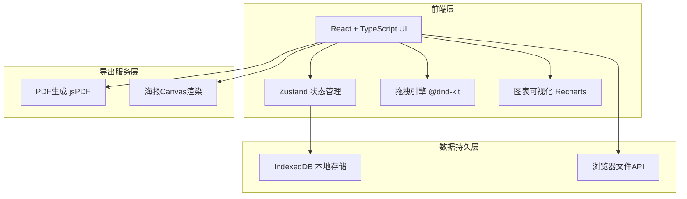
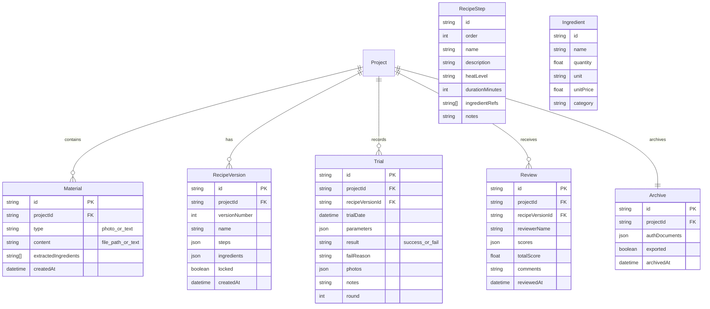

## 1. 架构设计

## 2. 技术说明

- **前端框架**：React@18 + TypeScript + Vite
- **初始化工具**：vite-init (react-ts 模板)
- **样式方案**：Tailwind CSS@3 + CSS Variables（主题色系）
- **状态管理**：Zustand（全局配方状态、项目状态、UI状态）
- **拖拽交互**：@dnd-kit/core + @dnd-kit/sortable（步骤编排拖拽）
- **图表可视化**：Recharts（雷达图、饼图、甘特图）
- **数据持久化**：IndexedDB via idb（本地离线存储，无后端依赖）
- **PDF/导出**：jsPDF + html2canvas（采购单、讲义、海报导出）
- **后端**：无（纯前端桌面应用，数据全部本地存储）
- **数据库**：IndexedDB（浏览器本地数据库）

## 3. 路由定义

| 路由 | 用途 |
|------|------|
| / | 工作台 - 项目概览与快速入口 |
| /materials | 素材库 - 照片导入、口述文本、食材提取 |
| /recipe | 配方板 - 步骤编排、食材用量、火候设置 |
| /timeline | 工序时间线 - 可视化流程甘特图 |
| /trials | 试做记录 - 试做列表与详情 |
| /trials/:id | 试做详情 - 参数记录、留样照片、失败标记 |
| /cost | 采购成本 - 成本估算与采购单 |
| /review | 评审发布 - 打分、版本比较、锁定、海报 |
| /archive | 资料归档 - 授权材料、讲义导出、项目打包 |

## 4. 数据模型

### 4.1 数据模型定义

### 4.2 IndexedDB 存储设计

- **projects**：项目主表，keyPath = id
- **materials**：素材表，keyPath = id，索引 projectId
- **recipeVersions**：配方版本表，keyPath = id，索引 projectId
- **trials**：试做记录表，keyPath = id，索引 projectId, recipeVersionId
- **reviews**：评审表，keyPath = id，索引 projectId, recipeVersionId
- **archives**：归档表，keyPath = id，索引 projectId
- **ingredientPrices**：食材价格表，keyPath = id

## 5. 组件架构

### 5.1 全局状态 (Zustand Stores)

- **useProjectStore**：当前项目、项目列表、CRUD操作
- **useRecipeStore**：当前配方版本、步骤列表、食材列表、拖拽排序
- **useTrialStore**：试做记录列表、当前试做详情、参数记录
- **useReviewStore**：评审列表、打分数据、版本比较
- **useUIStore**：侧边栏状态、模态框状态、通知消息

### 5.2 核心组件划分

| 组件目录 | 职责 |
|----------|------|
| components/layout/ | AppLayout, Sidebar, Header |
| components/materials/ | PhotoUploader, OralTextInput, IngredientExtractor, IngredientTag |
| components/recipe/ | StepCard, StepList, IngredientTable, HeatTimeEditor, DragHandle |
| components/timeline/ | GanttChart, TimelineStep, KeyNodeMarker |
| components/trial/ | TrialCard, TrialList, ParameterForm, PhotoGallery, FailMarker |
| components/cost/ | PriceTable, CostSummary, PurchaseOrder, CostChart |
| components/review/ | ScorePanel, RadarChart, VersionCompare, RecipeLocker, PosterGenerator |
| components/archive/ | FileList, AuthUploader, LectureExporter, ProjectPackager |
| components/shared/ | SealBadge, InkButton, PaperCard, InkTransition |

## 6. 关键技术方案

### 6.1 拖拽步骤编排

使用 @dnd-kit/sortable 实现步骤卡片的拖拽排序，支持：
- 步骤间拖拽重排
- 步骤内食材标签拖拽
- 拖拽时墨迹视觉反馈

### 6.2 离线数据存储

使用 idb 库封装 IndexedDB 操作：
- 所有数据存储在本地，无需网络
- 照片以 Blob 形式存入 IndexedDB
- 支持数据导入/导出为 JSON 文件

### 6.3 海报与讲义导出

- 海报：使用 Canvas API 渲染中国风模板，叠加菜品照片、菜名、评分
- 采购单/讲义：使用 jsPDF 生成 PDF，支持中文字体嵌入

### 6.4 食材提取逻辑

基于关键词匹配的本地食材提取：
- 维护常见食材词典（约500种）
- 从口述文本中模糊匹配食材名称
- 匹配结果可手动修正增删
